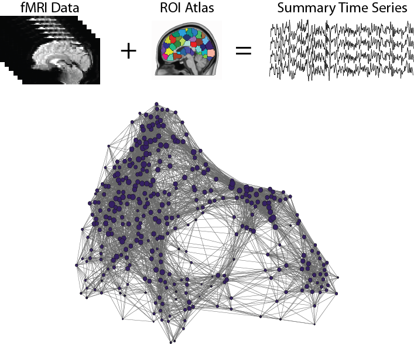
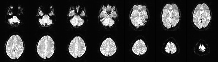
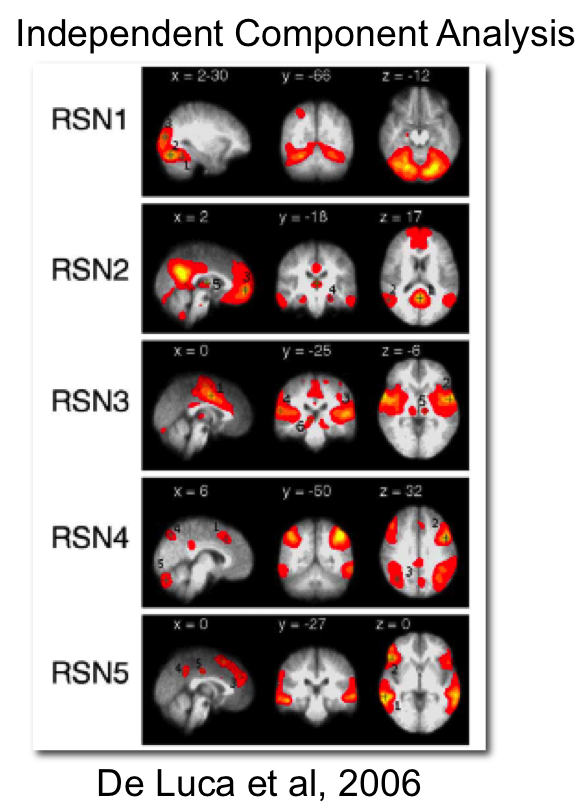
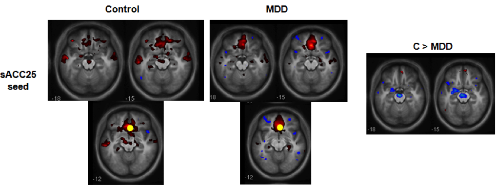
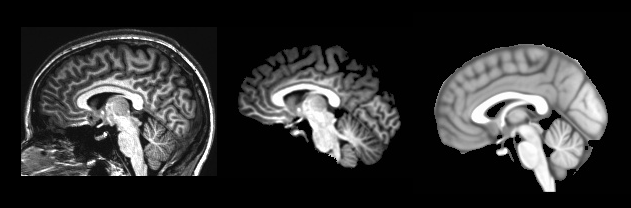
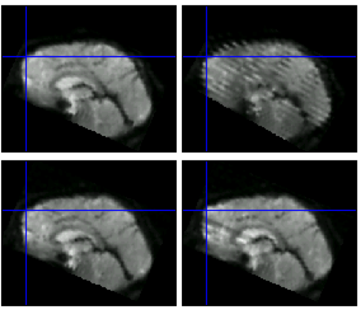
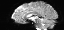

% Lecture #2: Mapping functional interactions in the connectome with fMRI
% R. Cameron Craddock, PhD
  Research Scientist VI, Nathan S. Kline Institute for Psychiatric Research, New York, NY
  Director of Imaging, Child Mind Institute, New York, NY
% July 29, 2014

---

#Overview of MRI

- Spinning hydrogen protons have a magnetic moment ($\mu$)
- At room temperature protons will align to an external magnetic field ($B_0$) to produce a net magnetization of roughly 3 ppm * $\mu$ per Tesla
- Hydrogen protons in a magnetic field precess at the Larmor frequency ($f=42.58\,Hz/T$)
- Protons can be *flipped* away from $B_0$ using a RF pulse centered at the Larmor frequency allowing their magnetic field to be measured using a receiver coil (antenna)
- Protons will return to aligment with $B_{0}$ with a time constant $T_1$
- The magnetization perpindicular to $B_{0}$ will dephase with a time constant $T_{2}^{*}$ due to diffusion and variations in the magnetic field
- Spatially varying magnetic fields (gradients) can be used to encode a spin's position in the frequency of its rotation

---

# Mapping functional interactions with fMRI

---

# fMRI depends on $T_{2}^{*}$ contrast

- An fMRI time-course is formed by the rapid acquisition of MR images that are sensitive to the "blood oxygen level dependent" (BOLD) contrast

1. Hemoglobin, the protein which transports oxygen in the blood, contains four heme molecules, each with an atom of iron
2. Deoxy-hemoglobin is paramagnetic and creates a magnetic gradient that dephases the MRI signal
3. Oxy-hemoglobin is diamagnetic and does not affect the MRI signal

---

# Hemodynamic response

<figure><small><figcaption>R.B. Buxton, NeuroImage 62 (2012) 953-961.</small></figcaption></figure>

- It is not know for certain how the hemodynamic response is triggered or the phsyiological mechanisms behind its shape, but a model is emerging from experimental evidence.

1. Initially neurons begin firing in response to a stimulus and consumes locally stored metabolites and oxygen, increasing the amount of deoxy-hemoglobin which decreases the MR signal
2. The body is instructed to increase blood flow to the area (via astrocytes?)
3. The rate of extraction of oxygen from blood (and oxygen metabolism) is slower than the blood flow, resulting in a net increase in oxygenated blood, and a MR signal increase
4. After neuronal activity ceases, the signal returns to baseline after a brief undershoot

---

# fMRI Data

- fMRI data are acquired using $T_{2}^{*}$ weighted gradient-echo EPI sequences
- The optimal $T_{E}$ for BOLD is 45ms at 1.5T and 30ms at 3T
- Spatial resolution is typically ~ $3 \times 3 \times 3 mm^3$
- $T_{R}$ depends on the number of slices acquired (~ 60ms per slice)
    ~ 120mm typically needed to cover entire brain, 40 slices, $T_{R} \approx 2500ms$  

---

# fMRI Experiment

<figure><figcaption><small>Finger tapping experiment.</small></figcaption></figure>

---

# Resting State Functional Connectivity

<figure><figcaption><small>Biswal et al. MRM 1995.</small></figcaption>

- Intrinsic activity is "ongoing neural and metabolic activity which is not directly associated with subjects’ performance of a task" - Raichle TICS 2010

--- 

# Intrinsic Connectivity Networks

    
    

---

# Functional Connectivity Analysis

- A "typical" resting state FC experiment comparing two groups

1. Data are preprocessed to make the comparable across participants and to remove noise
2. Indiviudal level FC maps are generated for a *seed* region by correlating the *seed time course* with the time course of every other voxel in the brain
3. FC maps are compared between groups voxel-by-voxel using t-tests or ANOVAs

---

# A note about structural images

- Structural imaging data are used to calculate spatial normalizations and to derive tissue masks
    - The calucalated transforms will be used to spatially normalize fMRI data
    - The segmentation masks will be used to calculate noise regressors

1. Image is skullstripped to remove non-brain structure  
2. Image is normalized to a standard template space using a highly-nonlinear (1000s of parameter) transformation
3. Image is segmented into white matter, grey matter, and cerebro-spinal fluid

---

# Functional Preprocessing

1. Slice timing correction
2. Motion correction
3. Calculate EPI - T1 transform
4. Nuisance variance regression
    - Linear and quadratic drifts
    - Physiological signals or WM and CSF
    - Motion parameters (6 or 24 regressor model)
5. Bandpass filter
6. Copy into MNI space
7. Spatial smoothing

---

# Slice Timing Correction

<figure><figcaption><small><a href="http://www.brainvoyager.com/bvqx/doc/UsersGuide/Preprocessing/SliceScanTimeCorrection.html">www.brainvoyager.com</a></small></figcaption>

- Since fMRI data is collected one slice at a time using gradient-echo EPI there is a ~60ms difference between the time that slices are acquired
- As a result time courses in different slices are not synchronized
- Slice timing correction, re-aligns the time courses by interpolating them all to the same timing

---

# Head Motion Correction - Coregistration

<figure><figcaption><small><a href="http://imaging.mrc-cbu.cam.ac.uk/imaging/CommonArtefacts">http://imaging.mrc-cbu.cam.ac.uk/imaging/CommonArtefacts</a></small></figcaption>

- Head motion is one of the most deleterious sources of noise in imaging
- Motion during the acquisition of a slice will result in blurring, ghosting, and other reconstruction errors
- Motion that occurs between the acquisition of slices will result in mis-registration of imaging volumes
- The misalignment between images can be accounted for using coregistration algorithms.

---

# Head Motion Correction - Intensity Modulation

- Additionally head motion adds in intensity modulations due to partial voluming effects and spin history
- These can be corrected by regressing models of motion from the dataset
    - 6 motion parameters (Fox et al. 2006)
    - 6 motion parameters, their squares, the parameters from the time before, and the squares of the previous parameters
    - scrubbing - delete frames near where head motion occurs
    - scrubbing regression - replace offending frames with mean
    - despiking - detect spikes and reduce them to a acceptable value

---

# Signal Drifts

- Throughout the course of the scan, as the gradients warm up, the MRI signal may slowly "drift"
- These are not very strong in newer MRIs, but are noticable from time to time
- These can be removed from the data by deterending, which models the drift as a low order polynomial and subtracts the fitted polynomial from the data

---

# Physiological Noise

- The brain pulses with the heart beat, which results in motion artifacts, and intensity modulations - can be measured in CSF and at saggital sinus
- The rise and fall of the abdomen in the magnetic field induces global intensity modulations, and the changes in depth and rate of breathing result in changes to brain oxygenation level
- Both of these noise sources can be modeled from recordings of heart rate (pulse oximeter) and respiration (repiratory belt), and regressed from the signal (PhysioFix, Retroicor)
- Due to difficulties collected physio recordings in the scanner, the signal from white matter and CSF are commonly regressed from the signal to account for this variance
    - WM and CSF are determined using tissue masks derived from anatomical image
    - white matter is a surrogate for respiratory effects
    - CSF is a surrogate for heart rate effects
    - Can use multiple regressors that account for spatial variation in the signal (AnatIcorr, CompCorr)
    
- Global signal is sometimes included as a non-specific surrogate for noise, but has become unpopular since it can introduce negative correlations

---

# Nuisance Variable Regression

- Previously discuss nuisance signals ($\mathbf{\eta}$) can be removed from the voxel time course ($v[t]$) using a regression model

$$v[t] = \mathbf{\beta}^T\mathbf{\eta[t]} + \nu[t] $$

- The residuals of the model $\nu[t]$ are the cleaned time courses

---

# Bandpass Filtering

- The resting state fMRI phenomenon is thought to be centered in the frequencies 0.001 Hz to 0.08 Hz, as a result it is common to apply a bandpass filter to the data to restrict the frequencies to this range
- This doesn't remove much noise, because it is smeared throughout the frequency range
- Many researchers now recommend to not use filtering, since their may be higher frequency information present in the data
- Filtering should be performed after nuisance signal regression

---

# Finally

- Now that the data is de-noised it is ready to use
- The data is written into standard space
- Data is smoothed to improve correspondance between brains of different subjects

---

# Calculating derivatives

<a href="http://fcp-indi.github.io/docs/user/derivs.html" >C-PAC User Guide</a>